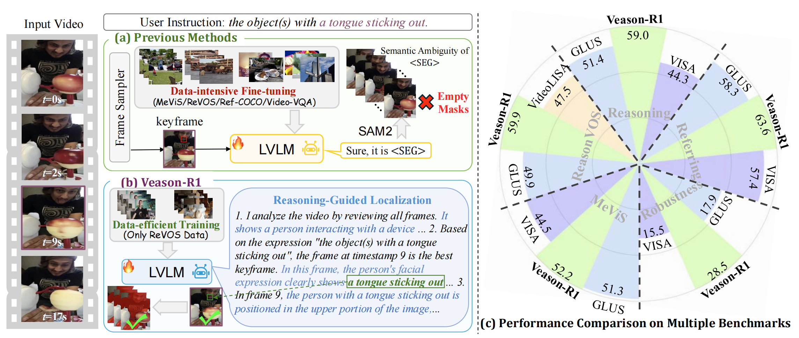
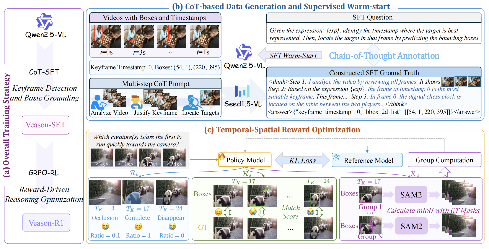

# Veason-R1: Reinforcing Video Reasoning Segmentation to Think Before It Segments

<!-- <p align="center">
  <strong>Sitong Gong*, Yunzhi Zhuge*†, Lu Zhang, Jiazuo Yu, Xu Jia, Pingping Zhang, Huchuan Lu</strong><br>
  IIAU Lab, Dalian University of Technology<br>
  <em>*Equal contribution, †Corresponding author</em>
</p>

<p align="center">
  <a href="https://arxiv.org/abs/xxxx.xxxxx">[Paper]</a>
</p> -->

## Motivation

<div align=center>

</div>

Video reasoning segmentation (VRS) requires pixel-wise mask prediction from language queries involving commonsense and implicit temporal relations. Prior LVLM-based methods compress video-level semantics into a single `<SEG>` token, yielding **opaque inference** and **weak spatiotemporal reasoning**. They lack structured reasoning traces, creating semantic ambiguity and brittle behavior in long, occlusion-prone videos. Moreover, these methods depend on **data-intensive multi-source training** (e.g., MeViS + ReVOS + Ref-COCO + Video-VQA), making them hard to scale and reproduce.

## Innovations

<div align=center>

</div>

- **Keyframe-First Reasoning Paradigm**: We reformulate VRS as a sequential decision problem — the model first selects a keyframe where the referred object is most salient, then grounds the object(s) for mask prediction, enabling interpretable step-by-step reasoning.

- **Two-Stage Training Strategy (CoT-SFT + GRPO-RL)**:
  - **Veason-SFT**: Warm-starts the policy via chain-of-thought (CoT) imitation learning, using structured multi-step prompts to acquire hierarchical priors that bridge video-level semantics and frame-level grounding.
  - **Veason-R1**: Refines the policy with critic-free Group Relative Policy Optimization (GRPO), using verifiable, task-aligned rewards.

- **Multi-Granularity Verifiable Reward Design**: Jointly measures (i) format compliance, (ii) temporal localization of the keyframe, (iii) spatial alignment via Hungarian-matched IoU, and (iv) cross-frame consistency via SAM2 mask propagation. KL regularization stabilizes preference optimization.

- **Data-Efficient Learning**: Trained on **only the ReVOS dataset**, without any multi-source data, yet achieves state-of-the-art results across multiple benchmarks.

## Contributions

1. We propose **Veason-R1**, the first reinforcement learning framework for VRS that employs GRPO-driven policy optimization with structured fine-tuning to jointly achieve keyframe identification and spatial grounding.
2. We design a **verifiable reward system** with temporal localization, spatial alignment, and cross-frame consistency rewards, enabling stable and interpretable preference optimization.
3. Despite training on ReVOS alone, Veason-R1 achieves **state-of-the-art** results on ReVOS, ReasonVOS, MeViS, and ViCaS, with significant improvements in hallucination robustness.

## Results

### ReVOS Benchmark

| Methods | Referring J&F | Reasoning J&F | Overall J&F | R |
|:--------|:---:|:---:|:---:|:---:|
| LISA-7B | 45.7 | 36.1 | 40.9 | 9.3 |
| VISA-13B | 57.4 | 44.3 | 50.9 | 14.5 |
| GLUS-7B | 58.3 | 51.4 | 54.9 | 17.9 |
| Omni-R1 | 64.1 | 53.7 | 58.9 | - |
| VRS-HQ-13B | 63.3 | 56.8 | 60.0 | 18.9 |
| **Veason-R1-3B** | **63.0** | **56.8** | **59.9** | **28.5** |
| **Veason-R1-7B** | **63.6** | **59.0** | **61.3** | **27.0** |

### ReasonVOS Benchmark

| Methods | J | F | J&F |
|:--------|:---:|:---:|:---:|
| VideoLISA-3.8B | 45.1 | 49.9 | 47.5 |
| GLUS-7B | 47.5 | 52.4 | 49.9 |
| **Veason-R1-3B** | **51.8** | **58.5** | **55.2** |
| **Veason-R1-7B** | **56.0** | **63.8** | **59.9** |

### MeViS Benchmark (Zero-Shot)

| Methods | J | F | J&F |
|:--------|:---:|:---:|:---:|
| VISA-13B | 41.8 | 47.1 | 44.5 |
| GLUS-7B | 48.5 | 54.2 | 51.3 |
| VRS-HQ-13B | 48.0 | 53.7 | 50.9 |
| **Veason-R1-3B** | **48.2** | **54.2** | **51.2** |
| **Veason-R1-7B** | **48.4** | **56.0** | **52.2** |

### ViCaS Benchmark (Zero-Shot)

| Methods | val J&F | test J&F |
|:--------|:---:|:---:|
| LMPM | 8.4 | 6.3 |
| VideoLISA | 10.7 | 7.8 |
| Video-LLaVA-Seg† | 20.5 | 16.5 |
| **Veason-R1** | **24.5** | **18.2** |

> † denotes methods fine-tuned on ViCaS. Veason-R1 is evaluated without any ViCaS training data.

## Installation

### Environment Setup

```bash
git clone https://github.com/SitongGong/Veason-R1.git
cd Veason-R1
conda create -n veason_r1 python=3.11 -y
conda activate veason_r1

pip install torch==2.5.1 torchvision==0.20.1 torchaudio==2.5.1
pip install -r requirements.txt
pip install -e .
pip install sam2
pip install matplotlib
```

### Key Dependencies

- `transformers==4.49.0`
- `vllm==0.7.3`
- `ray`
- `wandb`
- `qwen-vl-utils`
- `pycocotools`
- `sam2` (for mask propagation in reward computation)

## CoT Data Construction

The CoT training data is constructed in two steps under `training_data_construction/`:

### Step 1: Data Sampling

Sample a balanced subset from the ReVOS training set, preserving the distribution of referring/reasoning types and single/multi-instance categories:

```bash
python training_data_construction/data_sampling.py
```

This script:
- Analyzes the distribution of referring vs. reasoning expressions and single vs. multi-instance samples in the ReVOS training set
- Performs stratified sampling to select ~10K balanced training instances
- Outputs `meta_expressions_train_select.json`

### Step 2: Seed CoT Generation

Generate chain-of-thought reasoning traces using a strong VLM (e.g., Seed1.5-VL):

```bash
export OPENAI_API_KEY="your_api_key"

python training_data_construction/seed_cot_generation.py
```

This script:
- For each video sample, selects a keyframe from the top-5 frames ranked by target mask area
- Uniformly samples frames and overlays reference bounding boxes on the images
- Prompts the VLM with structured 3-step reasoning: (1) video summarization, (2) keyframe justification, (3) target localization
- Randomly selects from 3 diverse CoT templates to promote output diversity
- Uses multiprocessing (32 workers) for parallel generation
- Outputs conversation pairs with `<think>` and `<answer>` fields

## Training

### Stage 1: Supervised Fine-Tuning (SFT)

We use [LLaMA-Factory](https://github.com/hiyouga/LLaMA-Factory) for LoRA-based SFT on Qwen2.5-VL with the curated CoT data.

Please refer to the [LLaMA-Factory documentation](https://github.com/hiyouga/LLaMA-Factory) for installation and training instructions. The SFT data follows the LLaMA-Factory conversation format with `<think>...</think>` reasoning and `<answer>...</answer>` structured output.

### Stage 2: GRPO Reinforcement Learning

After SFT, run the GRPO training script:

```bash
bash training_scripts/run_qwen2_5_3b_revos_keyframe_sam_sft_mod.sh
```

**Key parameters you may need to adjust:**

```bash
# Path to the SFT checkpoint from Stage 1
MODEL_PATH=/path/to/your/sft_checkpoint

# Environment variables
export VLLM_ATTENTION_BACKEND=XFORMERS
export MKL_SERVICE_FORCE_INTEL=1
export RAY_memory_monitor_refresh_ms=0

python3 -m verl.trainer.main \
    config=training_scripts/video_seg_zero_3b_keyframe_sam_sft_mod.yaml \
    worker.actor.model.model_path=${MODEL_PATH} \    # SFT model path
    worker.actor.kl_loss_coef=5.0e-3 \               # KL regularization coefficient
    worker.actor.optim.lr=1.0e-6 \                   # Learning rate
    worker.actor.micro_batch_size_per_device_for_update=1 \
    worker.actor.micro_batch_size_per_device_for_experience=1 \
    worker.rollout.enable_chunked_prefill=false \
    worker.rollout.n=8 \                              # Group size for GRPO
    trainer.n_gpus_per_node=2 \                       # Number of GPUs
    trainer.total_episodes=1 \                        # Total training episodes
    trainer.save_checkpoint_path=/path/to/save/checkpoint
```

**GRPO config (`training_scripts/video_seg_zero_3b_keyframe_sam_sft_mod.yaml`):**

```yaml
data:
  train_files: /path/to/ReVOS               # ReVOS dataset root
  max_prompt_length: 7100
  max_response_length: 1024
  rollout_batch_size: 16
  sampled_frames: 6                          # Number of sampled frames per video
  keyframe_resize: 560

algorithm:
  adv_estimator: grpo                        # Group Relative Policy Optimization

worker:
  actor:
    global_batch_size: 16
    use_kl_loss: true
    kl_loss_coef: 5.0e-3
    kl_loss_type: low_var_kl
  rollout:
    temperature: 1.0
    tensor_parallel_size: 2
    gpu_memory_utilization: 0.25
    n: 8                                     # Group size for GRPO
  reward:
    reward_type: function
    compute_score: video_match_keyframe_sft_sam_mod  # Multi-granularity reward
```

The reward function (`grpo_reward/reward_score.py`) computes four components:
- **Format Reward** (`Rf`): Validates `<think>...<answer>` structure and JSON format
- **Keyframe Reward** (`Rk`): Ratio of mask area at predicted keyframe vs. maximum across frames
- **Spatial Reward** (`Rs`): Hungarian-matched IoU between predicted and GT bounding boxes
- **Consistency Reward** (`Ru`): Video-level mIoU via SAM2 mask propagation from matched boxes

## Inference
We provide inference code for ReasonVOS and it can alse be extended to other datasets.
```bash
bash multi_gpu_eval_keyframe_sft_mod_reason_vos.sh
```
Please reference [VISA](https://github.com/cilinyan/VISA) to compute evaluation metrics. 

## TODO List

- [x] Release dataset construction code
- [x] Release model training code
- [x] Release inference code
- [ ] Release model weights

## Acknowledgements

This project is built upon the following excellent works:

- [verl](https://github.com/volcengine/verl) - Volcano Engine Reinforcement Learning for LLMs
- [Seg-Zero](https://github.com/dvlab-research/Seg-Zero) - Reasoning-based segmentation with reinforcement learning
- [LLaMA-Factory](https://github.com/hiyouga/LLaMA-Factory) - Efficient fine-tuning framework for LLMs

We sincerely thank the authors for their outstanding contributions.

## Citation

```bibtex
@inproceedings{gong2026veason,
  title={Reinforcing Video Reasoning Segmentation to Think Before It Segments},
  author={Gong, Sitong and Zhuge, Yunzhi and Zhang, Lu and Yu, Jiazuo and Jia, Xu and Zhang, Pingping and Lu, Huchuan},
  booktitle={Proceedings of the IEEE/CVF Conference on Computer Vision and Pattern Recognition},
  year={2026}
}
```
